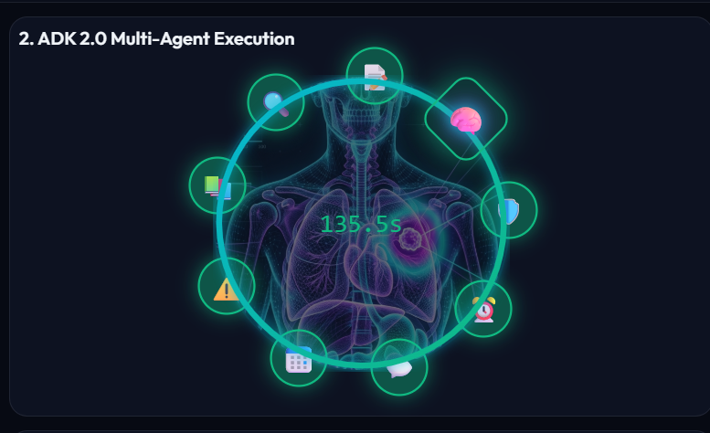
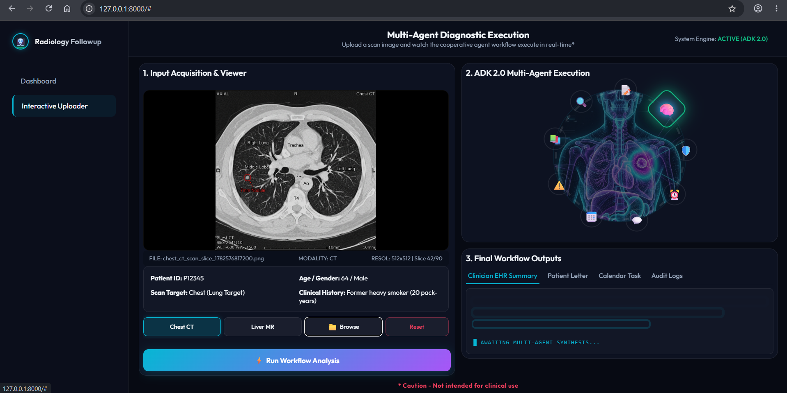
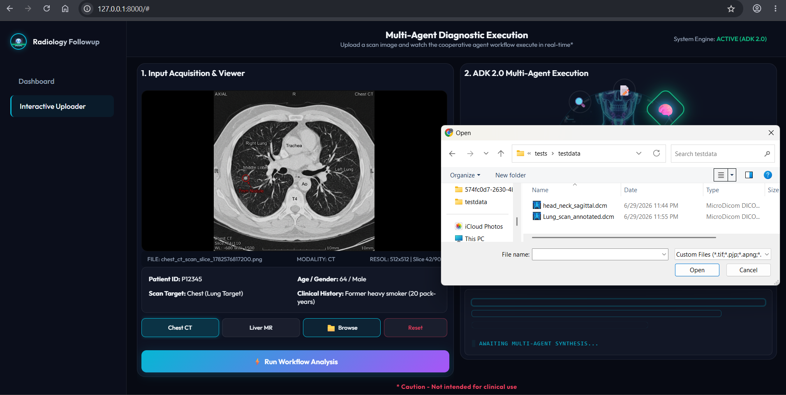
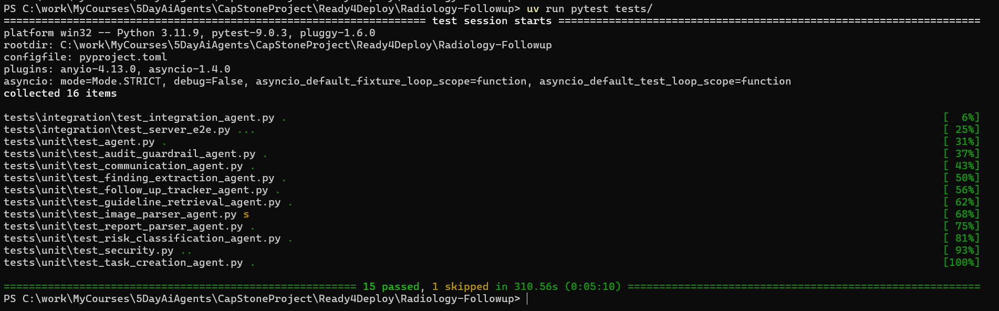
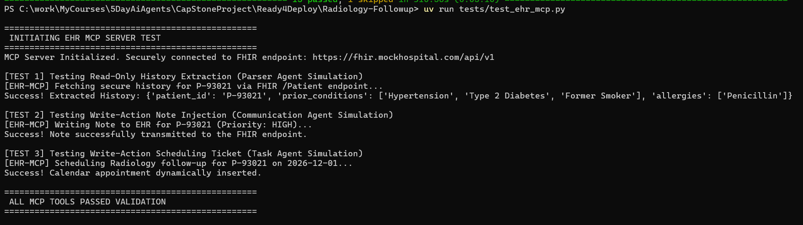

# Radiology Follow-up Capstone Project


## 🚨 The Problem

In modern healthcare, radiologists generate thousands of unstructured reports daily. Frequently, these reports contain incidental but critical findings (such as a small pulmonary nodule) that require a follow-up scan in 6 to 12 months to monitor for potential malignancy. 

Currently, expecting busy referring physicians to manually read these dense, free-text narratives, extract the recommended follow-up dates, schedule reminders, and track patient compliance months later is highly inefficient and prone to human error. When these follow-ups fall through the cracks, it leads to delayed diagnoses, worsened patient outcomes, and immense clinical risk. Existing Electronic Health Record (EHR) systems lack the semantic intelligence to automatically parse unstructured narratives and trigger these necessary workflows.

## 💡 The Solution

This project introduces a cutting-edge, AI-driven solution that automates the entire follow-up lifecycle. By harnessing an 8-agent sequential pipeline engineered via the **Google Agent Development Kit (ADK)**, this system acts as an autonomous administrative clinician. 

It seamlessly bridges the gap between raw medical imaging data and actionable clinical intervention by:
1. Ingesting and structuring complex medical reports (and raw DICOM images).
2. Evaluating clinical risk against established medical guidelines.
3. Automatically generating mathematically precise scheduling tasks.
4. Drafting tailored, patient-friendly communications to ensure compliance.


## 🏗️ Architecture & Data Flow

### 📂 Core Files Structure
The project is structured to clearly separate the backend multi-agent logic from the frontend UI and deployment configurations:

```text
Radiology-Followup/
├── app/                      # Main application logic
│   ├── agent.py              # Defines the 8-agent ADK pipeline and graph
│   ├── tools.py              # Custom tools (e.g., guideline lookup, date math)
│   ├── fast_api_app.py       # FastAPI backend serving the UI and endpoints
│   └── api/                  # API routes (DICOM handling, dashboard endpoints)
├── tests/                    # Comprehensive testing suite
│   ├── unit/                 # Isolated state-injected tests for each agent
│   └── integration/          # End-to-end multi-agent pipeline tests
├── assets/                   # Sample images (e.g., PNG CT/MRI scans)
└── radiology_interactive_workflow.html # The main frontend UI application
```

### 🧠 How Agents Interact



The pipeline operates as a **Sequential State Graph**. Rather than conversational agents talking to each other randomly, the system uses a highly structured, deterministic orchestration model:
1. **The Orchestrator 🧠**: A central workflow engine acts as the primary orchestrator. It is responsible for initiating the very first call in the pipeline when a user uploads a scan. Critically, after the final agent completes its review, the orchestrator gets control back at the end of the workflow, capturing the final compiled state to deliver safely back to the user interface.
2. **Shared State Object**: A central, strongly-typed `State` object acts as the strict memory repository for the entire pipeline.
3. **Sequential Handoff**: The **Report Parser Agent** receives the raw input. It extracts the initial findings, structurally updates the Shared State, and formally routes execution to the next node.
4. **Data Cascading**: The **Finding Extraction Agent** wakes up, reads the newly populated state, performs its specific entity extraction, updates the state again, and passes the baton down the line.
5. **Guardrailed Execution**: This linear, relay-race style interaction ensures that complex clinical reasoning is broken down into small, independently verifiable steps. This drastically reduces LLM hallucinations and enforces strict safety guardrails before any data is visualized or written to the EHR.

To ensure absolute clinical safety, the complete sequential pipeline consists of eight distinct, specialized AI agents:

1. 📄 **Report Parser Agent**: Ingests unstructured reports or images and extracts clinical history, technical protocol, findings, and impressions into a structured JSON format.
2. 🔍 **Finding Extraction Agent**: Performs deep semantic analysis to extract specific clinical entities (e.g., nodules, measurements) while strictly resolving medical negations.
3. 📚 **Guideline Retrieval Agent**: Queries an internal mock clinical guidelines registry (e.g., Fleischner criteria) based on the extracted findings to determine the recommended screening interval.
4. ⚠️ **Risk Classification Agent**: Assigns a clinical priority (`HIGH`, `MEDIUM`, `LOW`) based on finding severity, patient context, and the guideline screening interval.
5. 🗓️ **Task Creation Agent**: Uses the original exam date and the recommended interval to calculate a mathematically precise target calendar due date, generating an EHR task payload.
6. 💬 **Communication Agent**: Generates two distinct outputs: a professional Clinician Note for the EHR, and a 6th-grade reading level Patient-Friendly Explanation.
7. ⏱️ **Follow-up Tracker Agent**: Monitors the task and registers initial scheduling states, calendar reminders, and escalation rules.
8. 🛡️ **Audit & Guardrail Agent**: The final safety checkpoint. It rigorously reviews the completed pipeline outputs to verify timeline alignment, correct date math, and the absence of factual discrepancies before data leaves the system.


## 🚀 Instructions for Setup

### Requirements
Before you begin, ensure you have:
- **uv**: Python package manager for high-performance dependency installation - [Install uv](https://docs.astral.sh/uv/getting-started/installation/)
- **agents-cli**: Google Agent CLI tool (`uv tool install google-agents-cli`)

### Installation
1. Clone the repository https://github.com/gorlesk/Radiology-Followup. Navigate to the project directory:
   ```bash
   cd Radiology-Followup
   ```
2. Install all dependencies using the CLI:
   ```bash
   agents-cli install
   ```
3. Set your Google Cloud Environment Variables:
   Ensure you are logged into gcloud (`gcloud auth application-default login`) or have your API key set up for the Gemini models to execute.

### Running the App Locally

To interact with the system via a web interface and process your own scans:

1. Start the FastAPI local server:
   ```bash
   uv run uvicorn app.main:app --host 0.0.0.0 --port 8000
   ```
2. Open your browser and navigate to: [http://localhost:8000/](http://localhost:8000/) then UI launches as shown below:




3. Use the DICOM files from `tests\testdata` and click on the "Run workflow Analysis" button to start the flow. Workflow can also be run using the  `Chest CT` or `Live MR` buttons, which uses png files located in `assets` directory. 




Note: While using any DICOM (.dcm format) or image files (.png) files, they should have annotations for the findings to run workflow successfully.


### Running Semantic Evaluations
To evaluate the pipeline for **Safety** and **Hallucination** (i.e. ensuring the agent did not invent fake clinical guidelines or succumb to a prompt injection attack), run the following command:

``bash
uv run agents-cli eval run --dataset tests/eval/datasets/medical-eval.json --metrics safety,hallucination
``

Alternatively, you can interact with your multi-agent pipeline in real-time through a local terminal chat interface:
```bash
agents-cli playground
```

### Running Unit Tests

We have built a comprehensive suite of isolated and integration tests to ensure the agents act deterministically and without hallucinations.

To run the full test suite locally, use `uv`:
```bash
uv run pytest tests/unit/
```
*(Note: You can append `-s` to view the standard printed outputs during the test runs.)*

**Expected Successful Output:**




### Testing the Simulated MCP Server
We have included a completely isolated Python test script that simulates how this exact MCP connection would function in a real hospital environment.

To test the simulated EHR connection, run the following command in your terminal:
```bash
uv run tests/test_ehr_mcp.py
```

**Expected Successful Output:**


